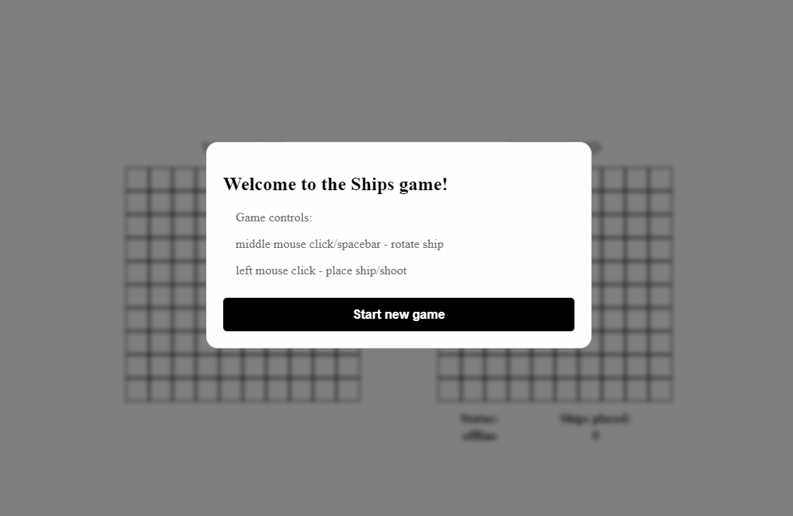

# Ships - a simple two-player game

Players must place 10 ships on their 10 x 10 board. Then they take turns shooting at the opponent's board and if it was a hit or the destruction of the opponent's ship - the next move is made by the player who shot. If there is no hit opponent will make the next move. The game ends when all of one player's ships are destroyed.

Live demo - https://shipsgame.gigalixirapp.com/
## Tech
The game logic was written in elixir using **gen_server**.
The frontend was created using phoenix and js - communication with the player is done using **phoenix channels**. 
When a player enters the homepage, he automatically joins the lobby channel, and when he clicks the "start new game" button, an available game is searched and the player joins the corresponding game channel - **phoenix presence** is responsible for monitoring players in the lobby and games channels.

